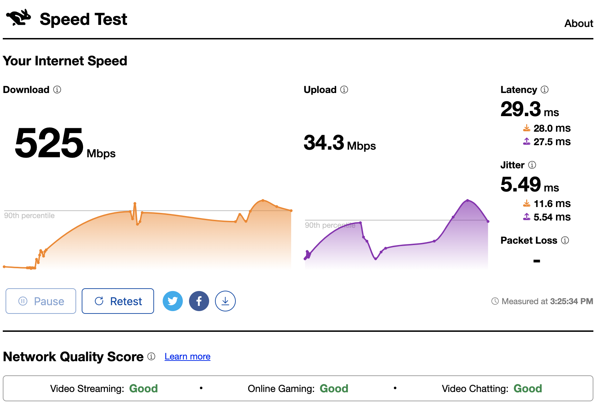
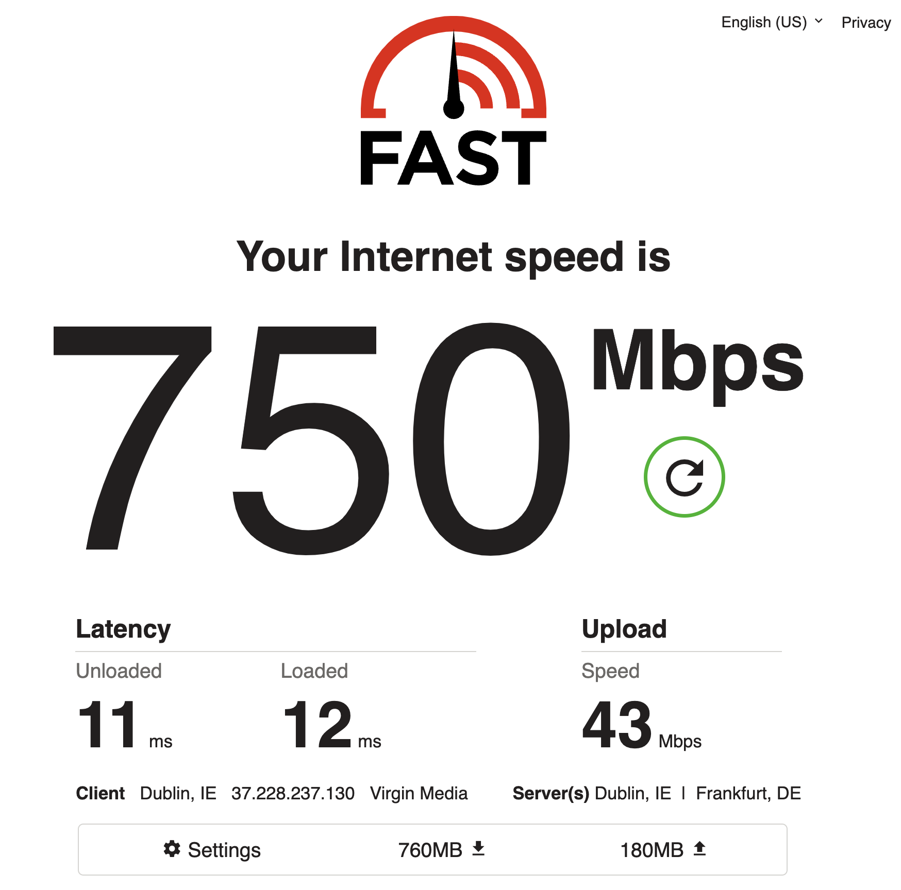
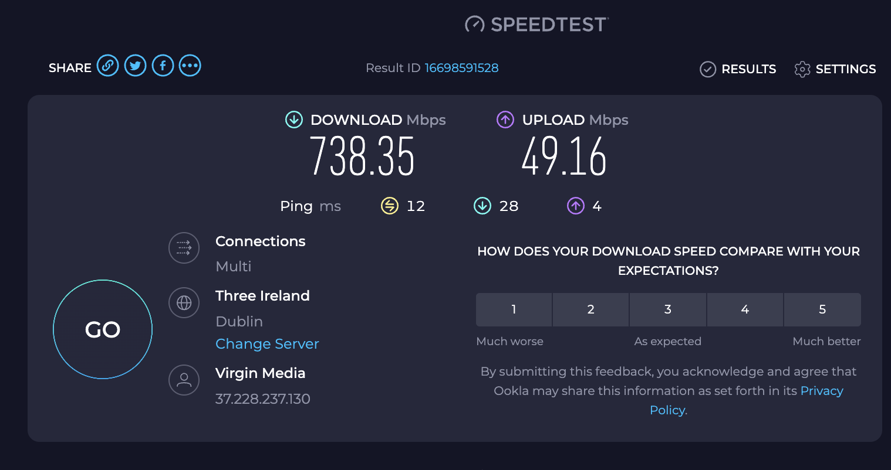
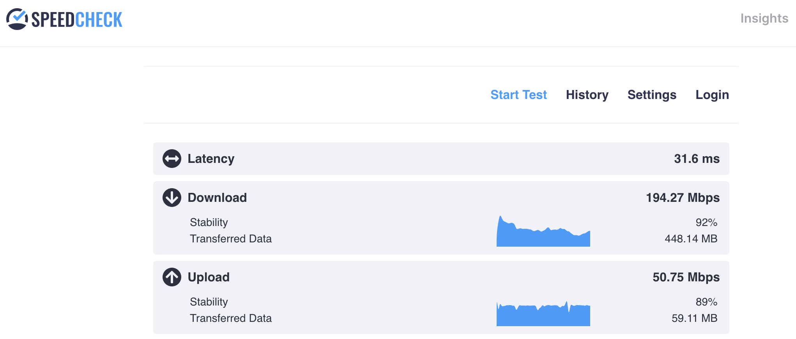
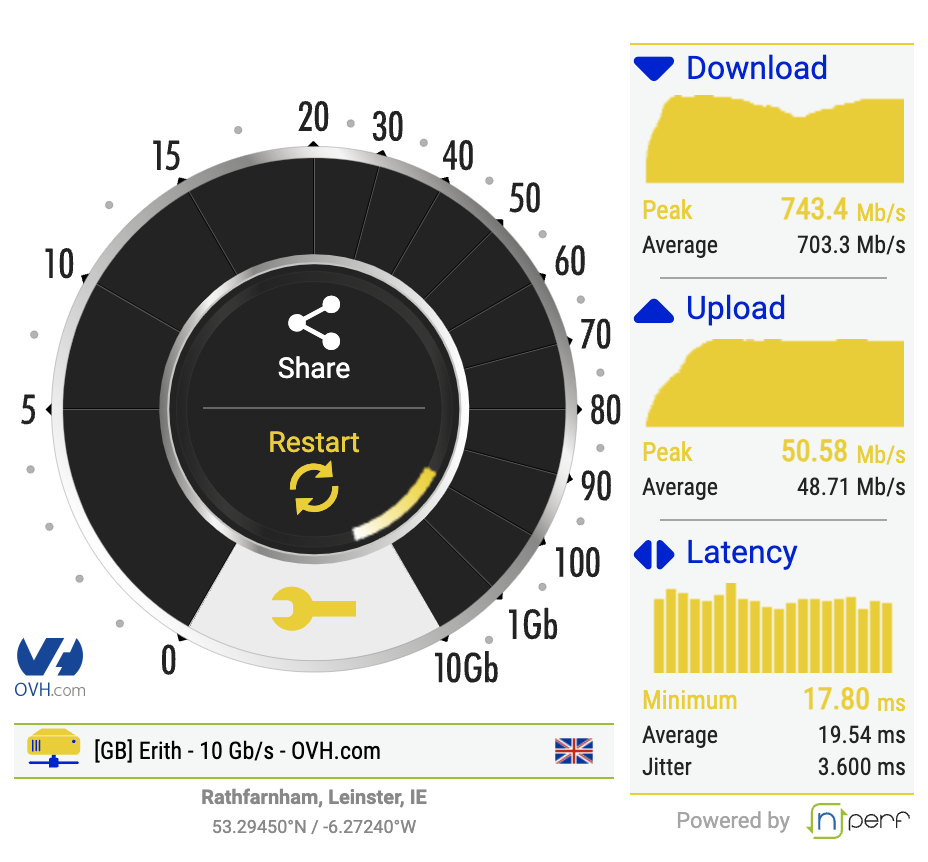

# Measuring Home Internet Speed

Your home internet speed, and how you percieve it, depends a lot on what you're doing and how you measure it.

Ideally you set up remote servers and with some form of test server where you can test the speed of connecting, downloading and uploading different file sizes and types and gain a deeper understanding of your place on the internet highway.

In reality we all have stuff to do and it's easier to just reach for an existing speed test from your provider or a 3rd party like netflix or cloudflare or speedtest.org. If you go this route I advice trying different tests and comparing the results to get a feeling for connections behaviour. 

Below are the my results from a wired connection (no Wifi) using a virgin media connection in Dublin, Ireland. Note the variance depending on server used 

| Test | Download (MBs) | Upload (MBs) | Server Location|
|----------|----------|----------|----------|
| [Cloudflare](https://speed.cloudflare.com/) | 525 | 34 | UK/London |
| [Netflix](https://www.speedcheck.org/) | 750 | 43 | Ireland/Dublin, Germany/Frankfurt|
| [Ookla](https://www.speedtest.net/) | 738 | 49 | Ireland/Dublin |
| [Speedcheck.org](Speedcheck.org)* | 194 | 51 | Ireland | 
| [Speedtest.org](https://www.speedcheck.org/)| 703 | 49 | UK|

From these results I have between 700 and 740 MBs download and bwtween 24 and 49 upload if we ignore speedcheck.org. 

Despite being an Irish server Speedcheck.org measured by far the lowest result. I replicated a similar result with speedtest.org by selecting a slower Irish server with 1Gbs bandwidth instead of the default 10Gbs one in the UK so it seems Speedcheck.org is throtteld by the server it's using.

To get a feel for 'average' speeds in your region, take a look at international surveys like:

* Speedtest.org - [Irish broadband survey 2023](https://media.nperf.com/files/publications/TN/2024-02-01_Barometre-fixed-connections-ireland-nPerf-2023.pdf)
* Statista Ranking of Countries with the fastest average [fixed broadband internet speeds worldwide as of July 2024 ](https://www.statista.com/statistics/896772/countries-fastest-average-fixed-broadband-internet-speeds/#:~:text=Countries%20with%20the%20fastest%20average%20fixed%20broadband%20internet%20speed%20worldwide%202024&text=As%20of%20July%202024%2C%20the,Hong%20Kong%20followed%20in%20third)
* Ookla - [The state of worldwide connectivity - 2023](by Ookla])https://www.ookla.com/articles/worldwide-connectivity-mobile-fixed-networks-digital-divide-2023)

## Test Details

### Cloudflare

Test: https://speed.cloudflare.com/

About: https://speed.cloudflare.com/about/

Results:

## Netflix Fast.com
Test: https://www.fast.com/

About: [Building fast.com](https://netflixtechblog.com/building-fast-com-4857fe0f8adb)

Results: 

### Ookla speedtest.net results
Test: https://www.speedtest.net/

About: https://www.ookla.com/resources/guides/speedtest-methodology

Results: 

### Speedcheck.org
Test: https://www.speedcheck.org/

About: n/a

Results: 

Note: Poor results likely based on NTLs server speed

### Speedtest.org
Test: https://www.speedtest.org/

About: https://www.speedtest.org/understanding-a-speed-test/

Results: 

Note: We used the auto selected server in the UK because it offered 10Gbs vs the 1Gbs Irish Server. 

